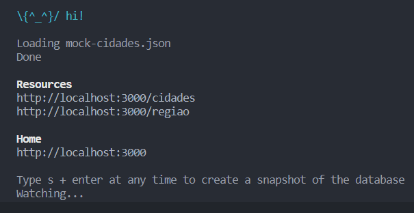
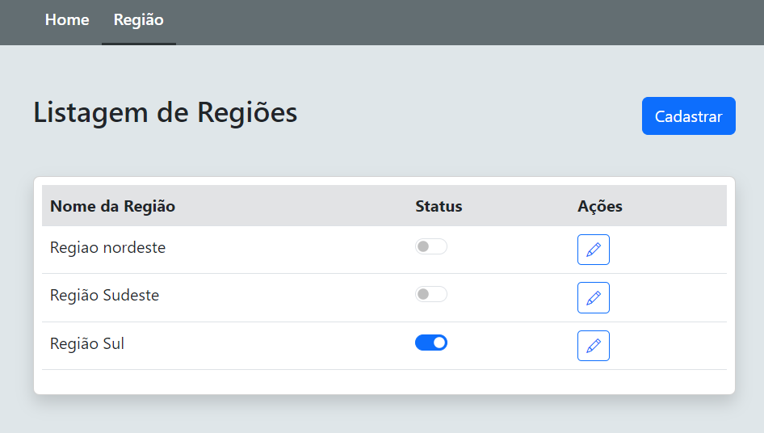
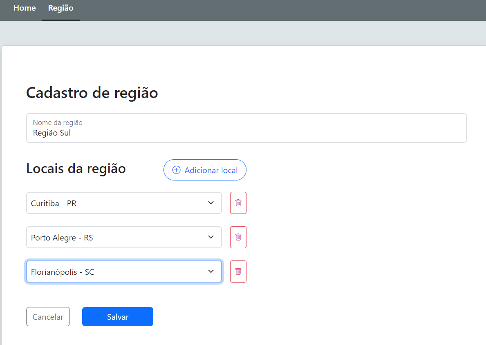
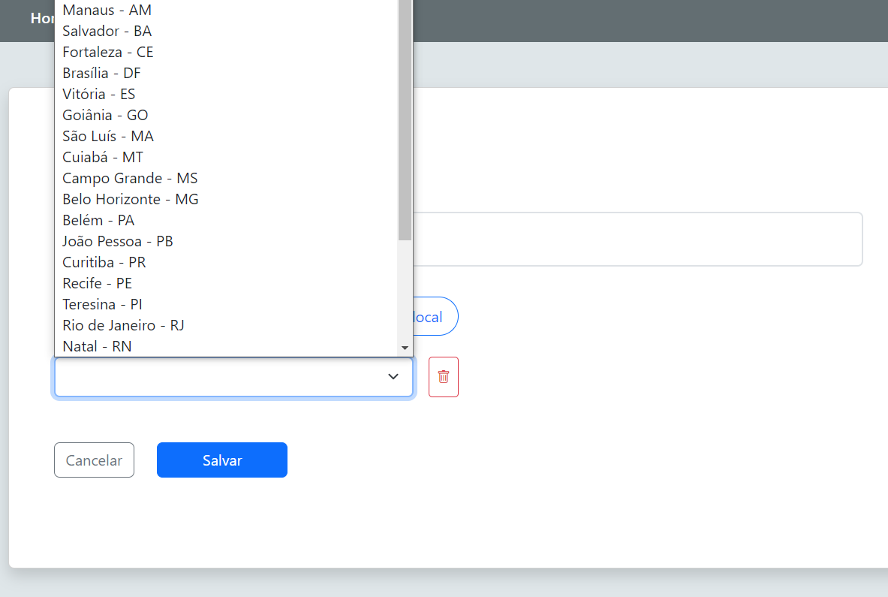

# Fretefy

### Tecnologias utilizadas 
- Angular@13.2.4
- Bootstrap

### Rodar projeto 

Para rodar o projeto em localhost, segir os passos abaixo:
### Passo 1 - Front-end
Abrir terminal e digitar os comandos:
1. `cd front-end`
2. `npm install`
3. `ng serve`
### Passo 2 - API mock
Abrir um segundo terminal e digitar os comandos:
1. `cd front-end`
2. `npx json-server --watch mock-cidades.json`
### Exemplo do Json-server rodando

### Passo 3 
Abrir o browser com esse link http://localhost:4200/regiao

### Interfaces

| Listagem de regiões | Cadastro de regiões | Seletor de cidades |
|:-------------:|:-------------:|:-------------:|
||||

### Referências:

- [Angular CLI Overview and Command Reference](https://angular.io/cli)
- https://www.npmjs.com/package/json-server
